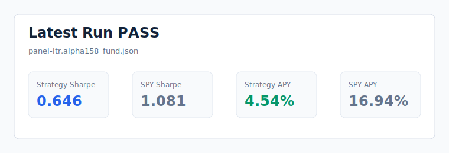
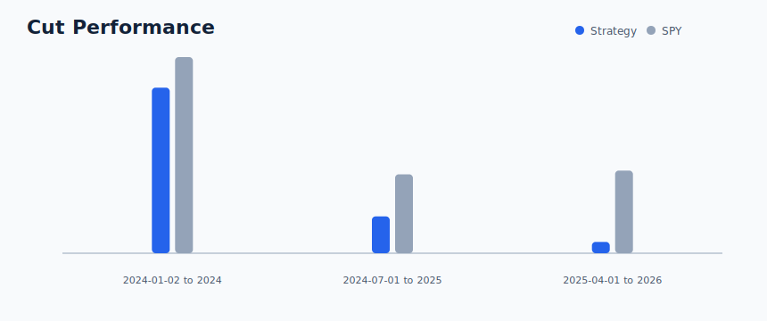
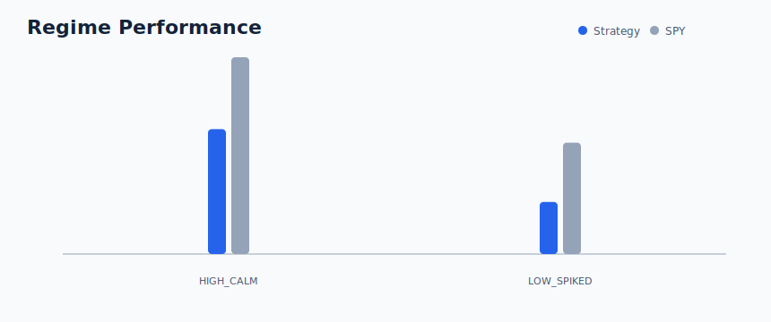
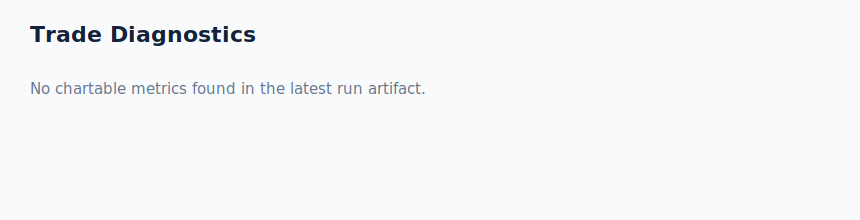

# Latest Simulation Run

Generated: `2026-05-30 23:58:36Z`
Source: `../RenQuant/backtesting/renquant_104/artifacts/diagnostics/wf_trade_traces/20260530T220958Z/2025-04-01_to_2026-03-28.equity.json`
Detected format: `equity_curve`

## Scoreboard

| Metric | Value |
|---|---:|
| `annual_net_apy` | 0.00% |
| `apy` | 0.00% |
| `annual_net_total_return` | 0.000 |
| `total_return` | 0.000 |
| `annual_net_max_dd` | 0.000 |
| `max_dd` | 0.000 |
| `final_value` | 100,000 |
| `annual_net_final_value` | 100,000 |
| `event_level_apy` | 0.00% |

## Walk-Forward Cuts

| Cut | Sharpe | SPY Sharpe | APY | SPY APY | Buys | Sells |
|---|---:|---:|---:|---:|---:|---:|
| 2025-04-01 to 2026-03-28 | n/a | n/a | 0.00% | n/a | n/a | n/a |

## Regime View

_No regime metrics found._

## Trade Diagnostics

_No aggregate trade-count diagnostics found._

_Refresh with `make latest-report`._
